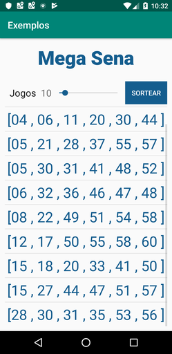
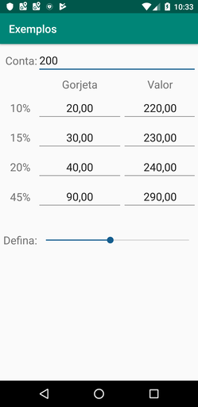
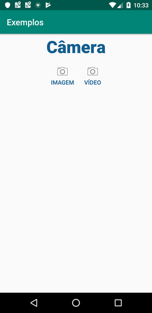
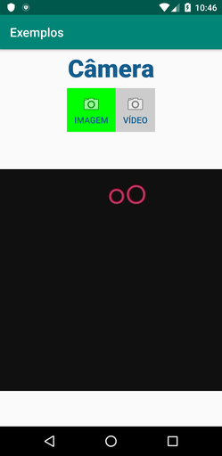
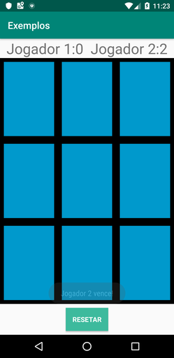

# Course Impacta (Pt-BR)

Project with several examples of simple methods
## Getting Started
#### Using Git Bash
```
git clone git@github.com:MurilloComino/android-course-impacta.git
```

#### Using Android Studio
```
in File > New > Project from Version Control... > git

in URL put: https://github.com/MurilloComino/android-course-impacta.git

and then clone
```
## Installing
* Connect via usb your android phone.
* After cloning the project, open the terminal and navigate to the root folder.

#### Windows
````
gradlew installDebug
````
#### Linux & MacOS
````
./gradlew installDebug
````

## Details

This project is based on the exercises proposed by the Android Developer course by Impacta <br />


## It features: <br />
###  &#9745; Mega Sena (Brazilian)
Create up to 100 games with 6 random numbers. <br />


###  &#9745; Gratuity 
Calculates the percentage of the amount paid. Used for tip payment.<br />


###  &#9745; Camera 
Generated photos and videos are shown in a FrameLayout, in addition to being added to the gallery.<br />



###  &#9745; CPF Validator (Registration of Individuals - Brazilian)
Validation calculation to verify the desired CPF.<br />


###  &#9744; Search Zipcode 
###  &#9745; Tic-tac-toe
Simple tic-tac-toe <br />



###  &#9745; Locate me
Capture latitude and longitude by entering the address and the option to view it in Google Maps <br />


###  &#9744; Notes
###  &#9744; Ball Game
###  &#9744; Music player
###  &#9744; Chat Blue
###  &#9744; SMS Messages 
###  &#9744; Camera
###  &#9744; Cannon Game
###  &#9744; Settings

## Built With

* [Android Studio 3.5](https://developer.android.com/studio) - The IDE used