#### English
# Project Description

Project with several examples of simple methods

## Details

This project is based on the exercises proposed by the Android Developer course by Impacta  
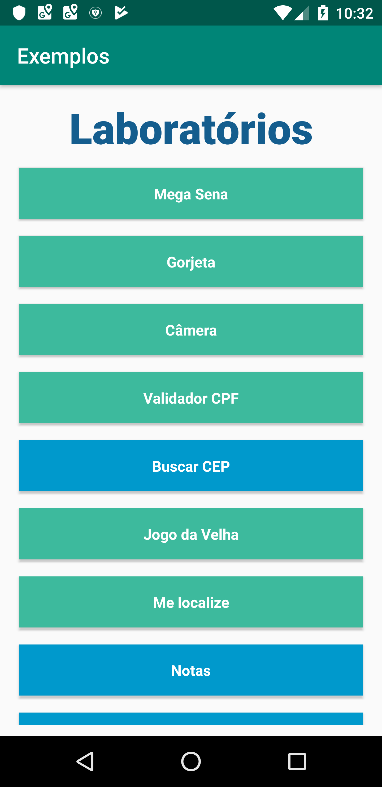

It features:  
####  &#9745; Mega Sena (Brazilian)
Create up to 100 games with 6 random numbers.

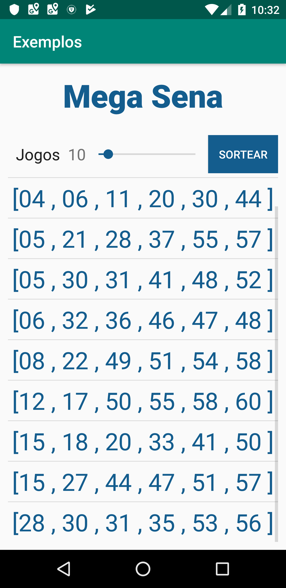
####  &#9745; Gratuity 
Calculates the percentage of the amount paid. Used for tip payment.
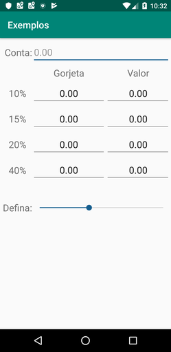
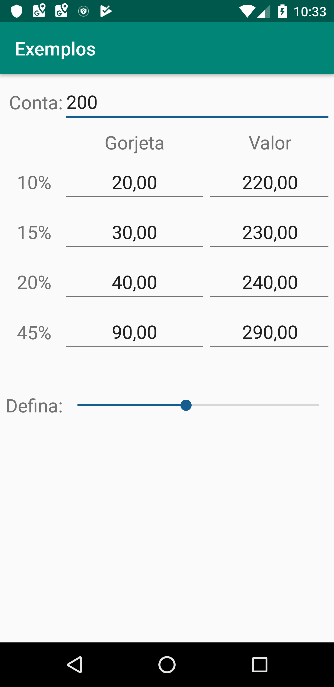
####  &#9745; Camera 
Generated photos and videos are shown in a FrameLayout, in addition to being added to the gallery.
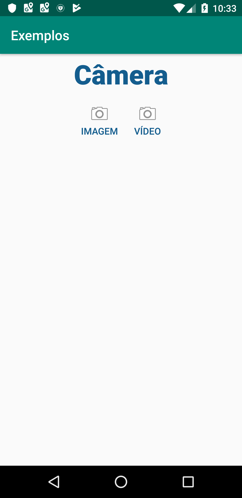

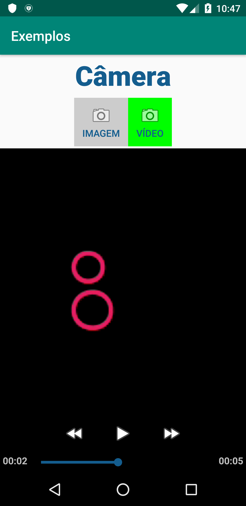
####  &#9745; CPF Validator (Registration of Individuals - Brazilian)
Validation calculation to verify the desired CPF.

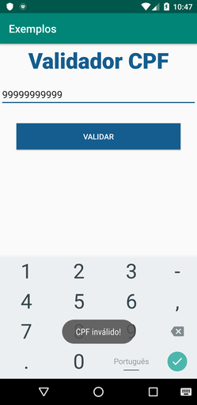
####  &#9744; Search Zipcode 
####  &#9745; Tic-tac-toe
Simple tic-tac-toe
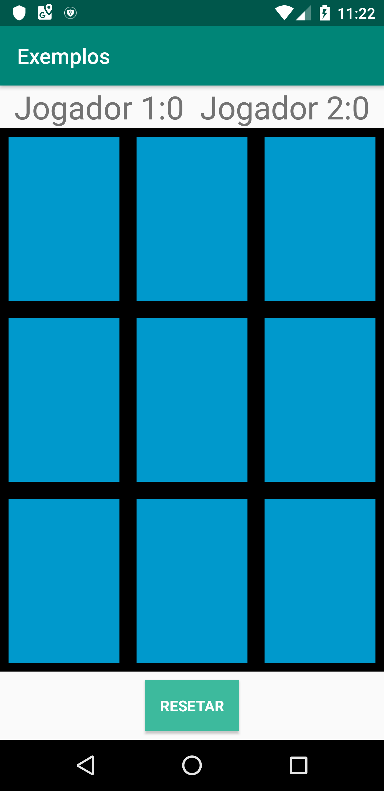
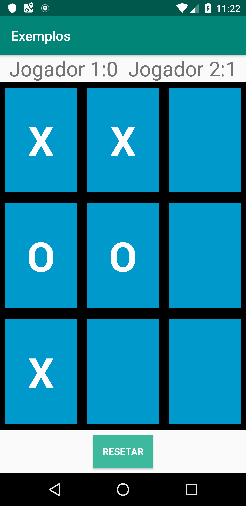
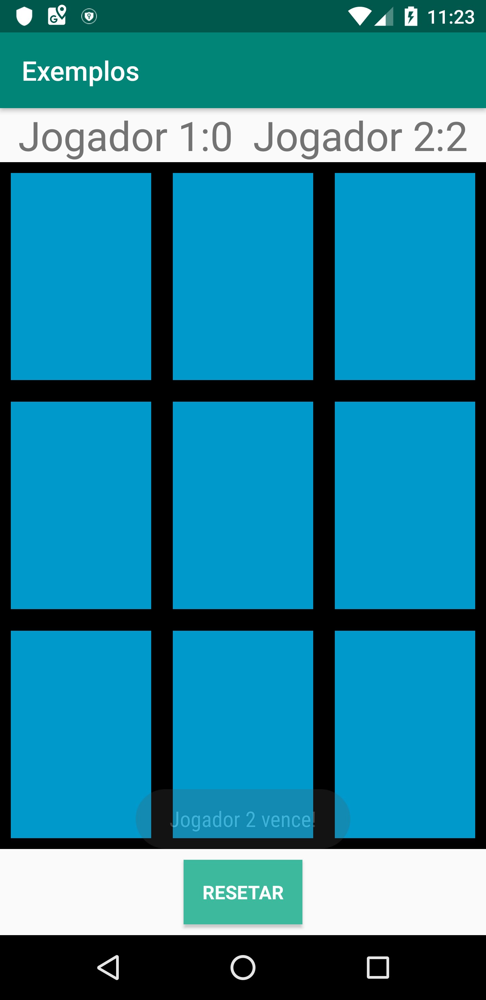
####  &#9745; Locate me
Capture latitude and longitude by entering the address and the option to view it in Google Maps

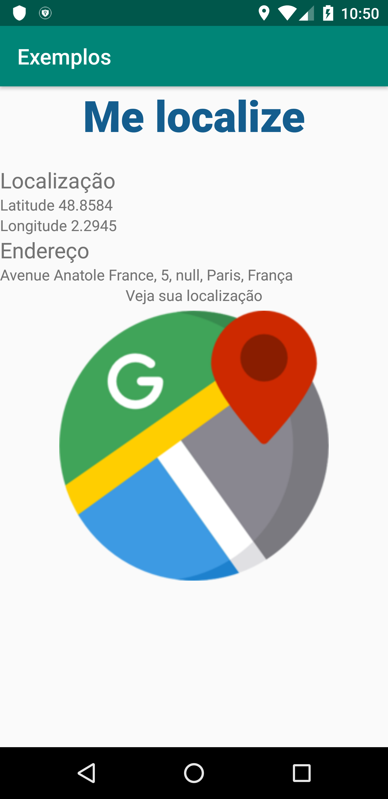
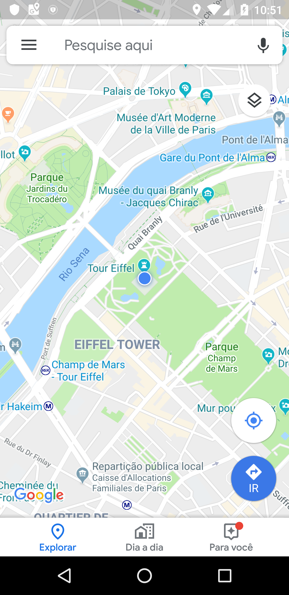
####  &#9744; Notes
####  &#9744; Ball Game
####  &#9744; Music player
####  &#9744; Chat Blue
####  &#9744; SMS Messages 
####  &#9744; Camera
####  &#9744; Cannon Game
####  &#9744; Settings

#### Portuguese
# Descrição do Projeto

Projeto com vários exemplos de métodos simples

## Detalhes

Esse projeto é baseado nos exercícios proposto pelo curso de Android Developer pela Impacta.  

Nele apresenta:  
####  &#9745; Mega Sena 
Sorteia até 100 jogos com 6 números aleatórios. 
####  &#9745; Gorjetas 
Cálcula a porcentagem do valor pago. Utilizado para pagamento de gorjeta.
####  &#9745; Câmera
Fotos e vídeos gerados são mostrados em um FrameLayout, além de serem adicionados na galeria. 
####  &#9745; Validador CPF 
Cálculo de validação para verificar o CPF desejado
####  &#9744; Procure CEP 
####  &#9745; Jogo da Velha
Simples jogo da velha
####  &#9745; Me localize
Captura a latitude e longitude, informando o endereço e com a opção de visualizar no Google Maps
####  &#9744; Notas 
####  &#9744; Jogo com Bola
####  &#9744; Music Player
####  &#9744; Chat Blue
####  &#9744; Mensagens SMS 
####  &#9744; Câmera 
####  &#9744; Jogo do Canhão 
####  &#9744; Configurações 